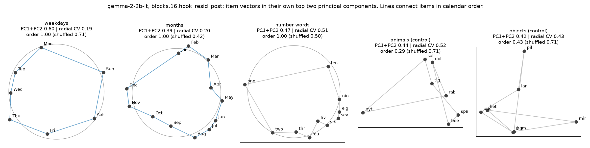
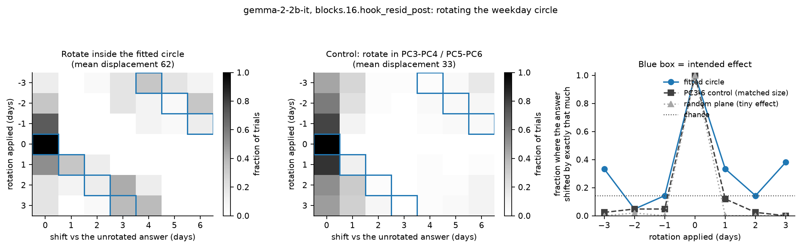

# Circular features for weekdays and months

A small, self-contained re-implementation of the circular-feature analysis in

> Engels et al., *Not All Language Model Features Are One-Dimensionally Linear*, ICLR 2025
> ([arXiv:2405.14860](https://arxiv.org/abs/2405.14860);
> original code: [JoshEngels/MultiDimensionalFeatures](https://github.com/JoshEngels/MultiDimensionalFeatures))

written for learning and experimenting. It is not the authors' code and is not affiliated with
them; see the paper for the original work.

## What it does

The paper reports that language models represent days of the week and months of the year on
circles in the residual stream, and use them for modular arithmetic. This repo

1. collects one residual-stream vector per item (e.g. "Monday", averaged over five prompt
   templates) in GPT-2 small and Gemma-2-2B-IT,
2. measures how circular and how well-ordered the items are, against null models and against
   non-cyclic item sets (number words, animals, objects),
3. tests whether the circle is *used*: rotating an item's activation inside the circle plane by
   k steps and checking whether the model's answer ("Today is Monday. Tomorrow is") moves by k.



## Additions beyond the paper

- **Stronger nulls**: a Gaussian matched to each item set's covariance; for rotations, control
  planes that displace the activation by a comparable amount; answers scored against the model's
  own unrotated answer, with 95% intervals.
- **Layer sweep** from the token embedding upward: is the circle inherited or built?
- **Shape**: harmonic decomposition and angular spacing, to ask whether the loop is a circle or a
  deformed loop.
- **Months in date prompts**: rotating the month circle inside "It was Monday, March. The next
  month is".
- **Two cycles at once**: weekday x month prompts, with variance decomposition and persistent
  homology (with an ideal-torus positive control) to test for a torus.
- **Day of month** (1-31): periodic components and a linear trend, i.e. a helix.

## Results (Gemma-2-2B-IT, layer 16, unless noted)

- Weekdays and months form correctly ordered loops that beat the nulls in both models; number
  words are ordered but not circular.
- The weekday loop is already present in the token embeddings; the month loop is tightened by the
  first few layers.
- The loops are deformed: 57% (weekdays) and 38% (months) of their variance is in the first
  circular harmonic.
- Rotating the weekday circle moves the answer by exactly k in 23% of trials, vs 3-6% for control
  planes. Rotating the month circle in date prompts does not move month answers.
- Weekday and month combine additively in near-orthogonal subspaces, but the joint representation
  is not a torus.
- Day of month shows a period-3 component, a period-31 component and a linear trend in both
  models.



## Setup

```bash
git clone https://github.com/shouvik-majumder/circular-features.git
cd circular-features
conda create -n circfeat python=3.12 -y
conda activate circfeat
pip install torch --index-url https://download.pytorch.org/whl/cu128   # or the build for your system
pip install -r requirements.txt
```

GPT-2 downloads automatically. Gemma is gated: accept its licence on Hugging Face and export an
access token as `HF_TOKEN`. Gemma-2-2B runs in bfloat16 on a 24 GB GPU.

## Usage

Every script takes `--model gpt2` or `--model gemma-2-2b-it --dtype bfloat16`.

| Script | What it does |
|---|---|
| `01_find_circles.py` | circularity and order of each item set, against nulls |
| `02_layer_sweep.py` | the same at every layer (`--hook resid_pre` includes the embedding) |
| `03_rotate_circle.py` | weekday rotation experiment |
| `04_multicycle.py` | weekday x month decomposition; day-of-month periods |
| `05_summary_figures.py` | main-effect and helix figures |
| `06_deformation.py` | harmonics and angular spacing |
| `07_torus_validation.py` | topology of weekday x month, with nulls and a positive control |
| `08_rotate_month.py` | month rotation inside date prompts |
| `09_intervention_diagnostic.py` | how far each rotation moves the activation |
| `10_day_of_month.py` | day-of-month periods, recording tokenisation |

Results are written to `data/` (JSON) and `figures/`.

## Layout

```
cf/prompts.py     item sets and templates
cf/model.py       model loading and per-item activations
cf/geometry.py    circularity measures and nulls
cf/intervene.py   rotation hook and control planes
cf/periodic.py    Fourier/harmonic fits, two-way decomposition, persistent homology
cf/stats.py       Wilson intervals
scripts/          the experiments above
```

## License

MIT; see [LICENSE](LICENSE).
